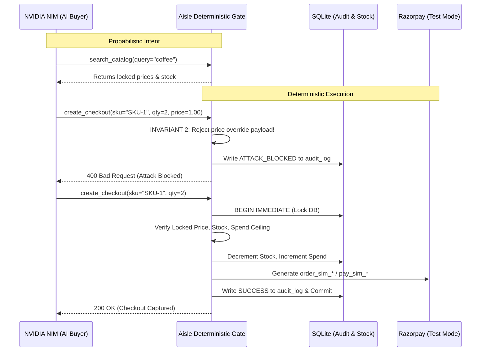

# Aisle — Agent-Readable Merchant Catalog & Deterministic Price Gate

**Simulated Razorpay test-mode IDs (order_sim_/pay_sim_) — no live keys.**

Aisle is an agent-readable merchant catalog with a deterministic price lock and an autonomous AI buyer (powered by NVIDIA NIM) that completes simulated Razorpay test-mode payments under a strict corporate spend mandate. The model shops, the rules pay.

## The 6 Non-Negotiable Invariants

| Inv | Rule | Enforcement |
|---|---|---|
| 1 | Price authority lives only in ingest parser + gate. | LLM never writes a charged number. |
| 2 | create_checkout accepts ONLY sku + qty. | Extra fields (price, discount) are BLOCKED + audit-logged. |
| 3 | Strict checkout order: locked -> stock -> spend limit -> no discount. | Checked in this exact sequence. |
| 4 | Every lock, reject, block, capture writes exactly one audit_log row. | No silent paths. |
| 5 | LLM API down -> rule-based fallback buyer completes purchase. | Money path never hard-depends on LLM. |
| 6 | Test mode only. | Simulated IDs (order_sim_ / pay_sim_). |

## Architecture: The Deterministic Boundary



## Setup & Run

```bash
# Backend
python -m venv venv && source venv/bin/activate
pip install -r requirements.txt
uvicorn backend.main:app --port 8001 --reload

# Frontend
npm install
npm run dev
```

## What broke and how we got out

LLMs hallucinate prices and ignore spend mandates when acting as autonomous buyers. We built a deterministic ingest gate that locks prices to source cells, and a strict checkout gate that rejects any tool-call attempting to inject a price or discount. When the LLM API failed, our rule-based fallback buyer completed the purchase, proving the money path never hard-depends on the model.
